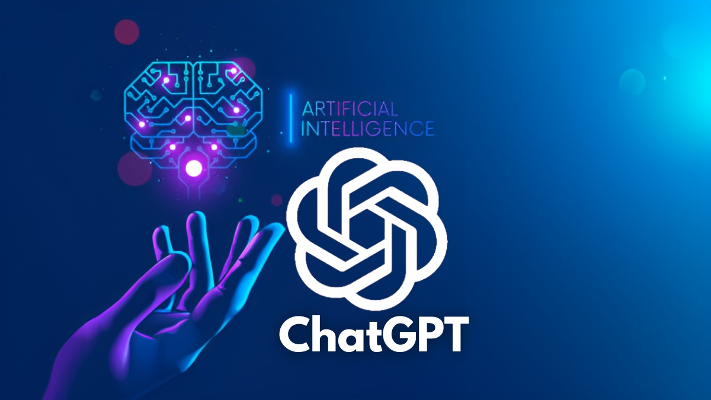

<h2 align="center">awesome-open-gpt</h2>

- **awesome-open-gpt** is a collection of 140+ selected open source projects related to GPT 🚀. Popular projects are marked with 🔥, including some GPT mirrors, GPT enhancements, GPT plugins, GPT tools, chatbots based on GPT-based conversational AI, open-source large-scale language models, and more.
- The purpose of the **awesome-list is** to help all GPT enthusiasts better focus on GPT open source applications, while also providing some useful resources for those who want to learn and use GPT models.
- **awesome-open-gpt** will continue to be updated, hoping to see more excellent GPT-related projects emerge!!! Also, the number of likes will be automatically updated every day (the script that automatically updates the star is also written using ChatGPT).

<!-- TOC -->
  * [Curated collection of open source projects](#curated-collection-of-open-source-projects)
    * [GPT-Mirror Surrogate](#gpt-mirror-surrogate)
    * [GTP Programming Language Client](#gtp-programming-language-client)
    * [GPT Auto 🔥🔥🔥](#gpt-auto-)
    * [Third Platform Robot](#third-platform-robot)
    * [GPT-Tool](#gpt-tool)
      * [GPT-Tool-Document](#gpt-tool-document)
      * [GPT-Tool-Programming](#gpt-tool-programming)
      * [GPT-Tool-General](#gpt-tool-general)
      * [GPT-Tool-Media](#gpt-tool-media)
      * [GPT-Tool-Others](#gpt-tool-others)
    * [GPT-Plugins](#gpt-plugins)
      * [GPT-Plugins-Official](#gpt-plugins-official)
      * [GPT-Plugins-Browser](#gpt-plugins-browser)
      * [GPT-Plugin-Third-party-Platform](#gpt-plugin-third-party-platform)
    * [GPT Open Source Replacement Robot](#gpt-open-source-replacement-robot)
    * [Specialized Domain Robot](#specialized-domain-robot)
    * [Prompt Conversation Instructions](#prompt-conversation-instructions)
    * [Other（Platform、Reverse engineering）](#otherplatformreverse-engineering)
  * [Relevant materials](#relevant-materials)
  * [Contribution](#contribution)
<!-- TOC -->

## Curated collection of open source projects

### GPT-Mirror Surrogate

| name                                 | github address | star | introduction                                                                                                                                                                                                                                                                                                                                                                                                                                                                                                                                                                                      | function                                                                                                                                                                                                       |
|--------------------------------------| --- | --- |---------------------------------------------------------------------------------------------------------------------------------------------------------------------------------------------------------------------------------------------------------------------------------------------------------------------------------------------------------------------------------------------------------------------------------------------------------------------------------------------------------------------------------------------------------------------------------------------------|----------------------------------------------------------------------------------------------------------------------------------------------------------------------------------------------------------------|
| ChatGPT Desktop-01                   | [lencx-ChatGPT🔥](https://github.com/lencx/ChatGPT) | 32.5k | 🔮 ChatGPT Desktop Application (Mac, Windows and Linux)                                                                                                                                                                                                                                                                                                                                                                                                                                                                                                                                           | 1. Export chat history (PNG, PDF and Markdown) 2. Support slash to bring up common Prompts (awesome-chatgpt-prompts) 3. Web login mode                                                                         |
| ChatGPT Desktop-02                   | [chatbox](https://github.com/Bin-Huang/chatbox) | 8.5k | Your Ultimate Copilot on the Desktop. Chatbox is a desktop app for GPT-4 / GPT-3.5 (OpenAI API) that supports Windows, Mac & Linux.                                                                                                                                                                                                                                                                                                                                                                                                                                                               | 1. Support Windows, Mac and Linux 2. Freer and more powerful Prompt capability 3. Support GPT-4 and other models 4. More features: Markdown, message reference, word count and token estimation, night mode... |
| ChatGPT Desktop-03                   | [chat-ai-desktop](https://github.com/sonnylazuardi/chat-ai-desktop) | 1.7k | Unofficial ChatGPT desktop app for Mac & Windows menubar using Tauri & Rust                                                                                                                                                                                                                                                                                                                                                                                                                                                                                                                       | 1. Support API mode, no login 2. Support menu bar display in Windows and Mac                                                                                                                                   |
| ChatGPT Desktop-04                   | [ChatGPT-Desktop](https://github.com/Synaptrix/ChatGPT-Desktop) | 1.3k | Fuel your productivity with ChatGPT-Desktop - Blazingly fast and supercharged!                                                                                                                                                                                                                                                                                                                                                                                                                                                                                                                    | 1.Support for setting conversation roles.2.Support for generating text-to-diagram visualizations                                                                                                               |
| NewBing Desktop                      | [BingGPT](https://github.com/dice2o/BingGPT) | 5.8k | Desktop application of new Bing's AI-powered chat (Windows, macOS and Linux)                                                                                                                                                                                                                                                                                                                                                                                                                                                                                                                      | 1. Chat with new Bing without installing Microsoft Edge or browser plug-ins 2. Export full conversations as Markdown, PNG, or PDF3. Customize the look (theme and font size)                                   |
| ChatGPT-Mac Menu                     | [chatgpt-mac](https://github.com/vincelwt/chatgpt-mac) | 5.3k | ChatGPT for Mac, living in your menubar.                                                                                                                                                                                                                                                                                                                                                                                                                                                                                                                                                          | 1. Display Chat GPT displayed in Mac menu bar 2. Use Cmd+Shift+G to evoke Chat GPT anywhere                                                                                                                    |
| ChatGPT-web Enhanced-01              | [visual-chatgpt](https://github.com/microsoft/visual-chatgpt) | 31.5k | Microsoft has open-sourced a tool that can add image capabilities to ChatGPT.                                                                                                                                                                                                                                                                                                                                                                                                                                                                                                                     | 1.Support for generating text-to-diagram visualizations.Support for generating text-to-update-image visualizations                                                                                             |
| ChatGPT-web Enhanced-02              | [chatgpt\_academic](https://github.com/binary-husky/chatgpt_academic) | 28.3k | This is a specialized ChatGPT/GLM extension for scientific research work, which is particularly optimized for enhancing the experience of polishing academic papers. It has a modular design that supports custom quick buttons and function plugins, as well as the display of code blocks and tables. It also features dual display of Tex formulas, added Python and C++ project analysis and self-translation functions, PDF/LaTex paper translation and summarization capabilities, and supports parallel inquiries of multiple LLM models. Additionally, it supports gpt-3.5/gpt-4/chatglm. | 1. Support one-click editing, one-click find paper syntax errors 2. One-click Chinese-English translation 3. Can correctly display the code and explain the code 4. One click can analyze other Python C++ projects 5. Can output markdown table that supports GPT|
| ChatGPT-web Enhanced-03              | [chatgpt-web](https://github.com/Chanzhaoyu/chatgpt-web) | 18.5k | ChatGPT demonstration webpage built using Express and Vue3.                                                                                                                                                                                                                                                                                                                                                                                                                                                                                                                                       | 1. Support downloading conversation content 2. Support Prompt template                                                                                                                                                                                         |
| ChatGPT-web Enhanced-04              | [ChatGPT-Next-Web](https://github.com/Yidadaa/ChatGPT-Next-Web) | 17.7k | One-Click to deploy well-designed ChatGPT web UI on Vercel.                                                                                                                                                                                                                                                                                                                                                                                                                                                                                                                 | 1. Use Vercel for free one-click deployment in 1 minute, and support container deployment 2. Massive built-in prompt list, from Chinese and English 3. One-click export of chat history, complete Markdown support |
| ChatGPT-web Enhanced-05              | [chatbot-ui](https://github.com/mckaywrigley/chatbot-ui) | 11.1k | An open source ChatGPT UI.                                                                                                                                                                                                                                                                                                                                                                                                                                                                                                                                                                        | 1. Support Prompt template 2. Support search chat content 3. Support GPT-44. Support code highlighting 5. Support Markdown output                                                                                                                                                        |
| ChatGPT-web Enhanced-06              | [ChuanhuChatGPT](https://github.com/GaiZhenbiao/ChuanhuChatGPT) | 9.2k | GUI for ChatGPT API and any LLM                                                                                                                                                                                                                                                                                                                                                                                                                                                                                                                                                                   | 1. Real-time reply 2. Unlimited conversations 3. Save conversation records 4. Preset Prompt set 5. Network search 6. Answer based on files                                                                                                                                                                  |
| ChatGPT-web Enhanced-07              | [BetterChatGPT](https://github.com/ztjhz/BetterChatGPT) | 3.0k | An amazing UI for OpenAI's ChatGPT (Website + Windows + MacOS + Linux)                                                                                                                                                                                                                                                                                                                                                                                                                                                                                                                            | 1. Support custom prompt vocabulary database 2. Support using folders to organize chats 3. Support custom user assistant system identity 4. Support saving chats as Markdown image JSON                                                                                                                                         |
| ChatGPT-web Enhanced-08              | [EX-chatGPT](https://github.com/circlestarzero/EX-chatGPT) | 1.5k | Let ChatGPT truly learn how to go online and call APIs! 'EX-ChatGPT' can rival and even surpass NewBing                                                                                                                                                                                                                                                                                                                                                                                                                                                                                           | 1. Voice dialogue function, using Microsoft Azure APIs, optimize response speed (about 1-2 seconds), including speech recognition and text-to-speech, support multiple timbre and language, customize voice. 2. Docker and proxy support. 3. Data cleaning of Google search results to reduce token usage. 4.Allow ChatGPT to call external API interfaces (Google, WolframAlpha, WikiMedia) |
| ChatGPT-web Enhanced-09              | [chatgpt-php-web](https://github.com/dirk1983/chatgpt) | 1.3k | Enhance your webpage with the PHP version and use OpenAI API for question and answer.                                                                                                                                                                                                                                                                                                                                                                                                                                                                                                             | 1. Added some preset words 2. Optimized the adaptation of mobile browsers                                                                                                                                                                                     |
| ChatGPT-web Enhanced-10              | [yakGPT](https://github.com/yakGPT/yakGPT) | 1.1k | Locally running, hands-free ChatGPT UI                                                                                                                                                                                                                                                                                                                                                                                                                                                                                                                                                            | 1. Support API call 2. Support voice input                                                                                                                                                                                              |
| ChatGPT-web Enhanced-11              | [multimedia-gpt](https://github.com/fengyuli-dev/multimedia-gpt) | 125 | Empowering your ChatGPT with vision and audio inputs.                                                                                                                                                                                                                                                                                                                                                                                                                                                                                                                                             | 1. Connect OpenAI GPT with vision and audio. You can now send images, audio recordings, and pdf documents using OpenAI API keys and get responses in text and image formats. Support for video is currently being added. |
| ChatGPT-Baidu WenXinYiYan OpenSource | [visual-openllm](https://github.com/visual-openllm/visual-openllm) | 832 | something like visual-chatgpt                                                                                                                                                                                                                                                                                                                                                                                                                                                                                                                                                                     | 1. Draw + chat                                                                                                                                                                                                        |
| ChatGPT-Command-01                   | [shell\_gpt](https://github.com/TheR1D/shell_gpt) | 4.3k | A command-line productivity tool powered by ChatGPT, will help you accomplish your tasks faster and more efficiently.                                                                                                                                                                                                                                                                                                                                                                                                                                                                             | 1. Support API calls 2. Support context                                                                                                                                                                                               |
| ChatGPT-Command-02                   | [aichat](https://github.com/sigoden/aichat) | 1.1k | Using ChatGPT/GPT-3.5/GPT-4 in the terminal.                                                                                                                                                                                                                                                                                                                                                                                                                                                                                                                                                      | 1. Support character presets 2. Syntax highlighting markdown and 200 other languages                                                                                                                                                                              |
| ChatGPT-Command-03                   | [pandora](https://github.com/pengzhile/pandora) | 1.2k | Pandora, a ChatGPT that is not just a command line.                                                                                                                                                                                                                                                                                                                                                                                                                                                                                                                                               | Multi-mode: Web command line API, private deployment                                                                                                                                                                                           |
| ChatGPT-Command+voice                | [chatgpt-conversation](https://github.com/platelminto/chatgpt-conversation) | 555 | Have a conversation with ChatGPT using your voice, and have it talk back.                                                                                                                                                                                                                                                                                                                                                                                                                                                                                                                         | 1. Chat with Chat GPT voice at the cli command line                                                                                                                                                                                          |
| ChatGPT-Clone                        | [chatgpt-clone](https://github.com/danny-avila/chatgpt-clone) | 293 | Clone of ChatGPT, uses official model & Bing, reverse-engineered UI, with AI model switching, message search, ChatGPT Plugins, and prompt templates (WIP)                                                                                                                                                                                                                                                                                                                                                                                                                                         | 1. Achieve the same response flow as ChatGPT through events sent by the server 2. Original ChatGPT UI 3.AI model selection including Dark mode (via 3 endpoints: OpenAI API, BingAI and ChatGPT browser) 4. Create, save and share custom presets for OpenAI and BingAI endpoints 5. Edit and resubmit messages like official website (session branch supported) 6. Search all message conversations 7. The plugin will be integrated soon |

### GTP Programming Language Client

| name | github address | star | introduction                                                                                                                                                                                                                                          | function                                                                  |
| --- | --- | --- |-------------------------------------------------------------------------------------------------------------------------------------------------------------------------------------------------------------------------------------------------------|---------------------------------------------------------------------------|
| Node-ChatGPT Client | [chatgpt-node](https://github.com/transitive-bullshit/chatgpt-api) | 13.0k | Node.js client for the official ChatGPT API. 🔥                                                                                                                                                                                                       |                                                                           |
| Python-ChatGPT Client | [PyChatGPT](https://github.com/rawandahmad698/PyChatGPT) | 3.9k | ⚡️ Python client for the unofficial ChatGPT API with auto token regeneration, conversation tracking, proxy support and more.                                                                                                                          | 1. Has automatic token regeneration, session tracking, proxy support, etc |
| Python-Shell-ChatGPT Client | [chatgpt-wrapper](https://github.com/mmabrouk/chatgpt-wrapper) | 3.1k | API for interacting with ChatGPT and GPT4 using Python and from Shell.                                                                                                                                                                                | 1.support ChatGPT4                                                        |
| Java-ChatGPT Client-01 | [chatgpt-java](https://github.com/PlexPt/chatgpt-java) | 2.0k | ChatGPT Java SDK。support GPT3.5、 GPT4 API。Works right out of the box。                                                                                                                                                                                                           | 1. Support context, blocking dialogs, agents, etc                         |
| Java-ChatGPT Client-02 | [chatgpt-java](https://github.com/Grt1228/chatgpt-java) | 1.2k | Java client for Chat GPT。OpenAI GPT-3.5-Turb GPT-4 Api Client for Java                                                                                                                                                   | 1. Support all official interfaces of Open AI 2. Support streaming output |
| Java-OpenAi Client | [openai-java](https://github.com/TheoKanning/openai-java) | 2.5k | OpenAI GPT-3 Api Client in Java                                                                                                                                                                                                                       | 1.support GPT-4                                                           |
| Node-ChatGPT-Bing Client | [node-chatgpt-api](https://github.com/waylaidwanderer/node-chatgpt-api) | 3.2k | A client implementation for ChatGPT and Bing AI. Available as a Node.js module, REST API server, and CLI app.                                                                                                                                         | 1.support BingAIClient2.support ChatGPTBrowserClient reverse                     |
| Go-OpenAi Client | [go-openai](https://github.com/sashabaranov/go-openai) | 4.3k | OpenAI ChatGPT, GPT-3, GPT-4, DALL·E, Whisper API wrapper for Go                                                                                                                                                                                      | 1.support GPT-4                                                           |
| PHP-OpenAi Client | [openai-php](https://github.com/orhanerday/open-ai) | 1.5k | OpenAI PHP SDK : Most downloaded, forked, contributed, huge community supported, and used PHP (Laravel , Symfony, Yii, Cake PHP or any PHP framework) SDK for OpenAI GPT-3 and DALL-E. It also supports chatGPT-like streaming. (ChatGPT AI is supported) |                                                                           |
| Android-ChatGPT Client | [chatgpt-android](https://github.com/skydoves/chatgpt-android) | 2.6k | 📲 ChatGPT Android demonstrates OpenAI's ChatGPT on Android with Stream Chat SDK for Compose.                                                                                                                                                         |                                                                           |
| .Net-ChatGPT Client | [openai-dotnet](https://github.com/betalgo/openai) | 1.6k | OpenAI ChatGPT, Whisper, GPT-3 , GPT-4, Azure OpenAI and DALL-E dotnet SDK                                                                                                                                                                            |                                                                           |

### GPT Auto 🔥🔥🔥

| name | github address | star | introduction | function |
| --- | --- | --- | --- | --- |
| GPT Auto-01 | [Auto-GPT🔥](https://github.com/Significant-Gravitas/Auto-GPT) | 91.1k | An experimental open-source attempt to make GPT-4 fully autonomous. | 1. Unlike Chat GPT, users do not need to constantly ask questions to the AI to get corresponding answers, in Auto GPT just provide it with an AI name, description and five goals, and then Auto GPT can complete the project by itself.2. It can read and write files, browse the web, review the results of its own prompts, and combine it with the history of said prompts. |
| GPT Auto-01-plugins | [Auto-GPT-Plugins🤔](https://github.com/Significant-Gravitas/Auto-GPT-Plugins) | 482 | Plugins for Auto-GPT | There is no content for the time being, the repository comes from Auto GPT authors, it is worth paying attention to!!! |
| GPT Auto-01-web | [autogpt-gui](https://github.com/thecookingsenpai/autogpt-gui) | 675 | A graphical user interface for AutoGPT |  |
| GPT Auto-01-Chinese version | [Auto-GPT-ZH](https://github.com/kaqijiang/Auto-GPT-ZH) | 307 | Auto-GPT Chinese version and hobbyist organization Synchronously update the original project AI field entrepreneurship Self-media organization Use AI work and learning to create monetization |  |
| GPT Auto-02 | [AgentGPT🔥](https://github.com/reworkd/AgentGPT) | 15.6k | 🤖 Assemble, configure, and deploy autonomous AI Agents in your browser. | 1. Name your own custom AI and let it start with whatever goal you can think of. It will try to do the task by thinking about it |
| GPT Auto-03 | [babyagi](https://github.com/yoheinakajima/babyagi) | 10.6k | Just give a goal and task iteration to let the AI automate your task |  |
| GPT Auto-04 | [micro-gpt](https://github.com/muellerberndt/micro-gpt) | 725 | A minimal generic autonomous agent based on GPT-3.5 / GPT-4. Can analyze stock prices, perform network security tests, create art, and order pizza. | 1. Can analyze stock prices, perform cybersecurity tests, create artistic pictures, and order pizza. |

### Third Platform Robot

| name | github address | star | introduction                                                                                                                                                                                                                         | function                                                                                                                                                                                                                                                                                                                               |
| --- | --- | --- |--------------------------------------------------------------------------------------------------------------------------------------------------------------------------------------------------------------------------------------|----------------------------------------------------------------------------------------------------------------------------------------------------------------------------------------------------------------------------------------------------------------------------------------------------------------------------------------|
| Wechat-ChatGPT-Robot-01 | [wechat-chatgpt](https://github.com/fuergaosi233/wechat-chatgpt) | 11.3k | Use ChatGPT On Wechat via wechaty                                                                                                                                                                                                    | 1. Use ChatGPT in WeChat based on wechaty and Official API 2. Support multi-round conversation 3. Support command setting 4. Support Dall· E5.Support whisper6.Support setting prompt                                                                                                                                                  |
| Wechat-ChatGPT-Robot-02 | [chatgpt-on-wechat](https://github.com/zhayujie/chatgpt-on-wechat) | 9.4k | Wechat robot based on ChatGPT, which using OpenAI api and itchat library.                                                                                                                                                            | 1. Support rule customization 2. Multi-account 3. Image generation 4. Context memory 5. Speech recognition 6. Plug-in                                                                                                                                                                                                                  |
| Wechat-ChatGPT-Robot-03 | [ChatGPT-wechat-bot](https://github.com/AutumnWhj/ChatGPT-wechat-bot) | 3.6k | ChatGPT for wechat                                                                                                                                                                                                                   | 1. Support contextual dialogue. 2. Support resetting the context context, and reset the conversation context through the keyword (reset). 3. Support in group chat @ your bot 🤖 , @robot to receive a response. 4. Support waking up your bot with keywords, such as receiving a reply when sending "@robot hello xxxx" in the group. |
| Wechat-ChatGPT-Robot-04 | [openai-on-wechat](https://github.com/riba2534/openai-on-wechat) | 100 | 🍺An OpenAI WeChat chatbot implemented in Golang                                                                                                                                                                                     | - Text conversation: You can receive private chat group chat messages, use OpenAI's gpt-3.5-turbo to generate reply content, automatically reply to questions- Trigger password setting: Friends need to bring a specified prefix when sending you a message to trigger a conversation with GPT bot, and the trigger password can be set in the configuration file- Continuous conversation: support for private chat group chat Turn on the continuous conversation function, you can set how many minutes you need to remember through the configuration file- Image generation: You can generate pictures according to the description, And automatically reply in the current private chat group chat |
| QQ AND Telegraph-ChatGPT-Robot | [OpenaiBot](https://github.com/LlmKira/Openaibot) | 1.4k | Refractoring 🚧ChatBot+LLM 、Gpt-3.5-turbo、ChatGPT Bot/Voice Assistant 、📱 Cross-Platform 、🦾 Async、🗣 Good Contextual Support、🌻 sh & docker、🔌 API Server、🎤 Azure/Vits 、🌎 、 📷 Multi-modal/Image、💐 Self-maintained LLM Framework | ChatBot+LLM                                                                                                                                                                                                                                                                                                                            |
| Discord-ChatGPT-Robot | [chatGPT-discord-bot](https://github.com/Zero6992/chatGPT-discord-bot) | 1.9k | Integrate ChatGPT into your own discord bot                                                                                                                                                                                          | 1. Switch GPT interface mode, support 4.0 2. Support Dalle2 raw graph                                                                                                                                                                                                                                                                                                         |
| Telegraph-ChatGPT-Robot-01 | [ChatGPT-Telegram-Workers](https://github.com/TBXark/ChatGPT-Telegram-Workers) | 2.5k | Deploy your own Telegram ChatGPT bot on Cloudflare Workers with ease.                                                                                                                                                                | 1. Use Cloudflare Workers, single file, directly copy and paste a shuttle, without any dependencies, no need to configure a local development environment, no domain name, no server |
| Telegraph-ChatGPT-Robot-02 | [chatgpt-telegram-bot](https://github.com/n3d1117/chatgpt-telegram-bot) | 1.2k | 🤖 A Telegram bot that integrates with OpenAI's official ChatGPT APIs to provide answers, written in Python                                                                                                                          | 1. Support markdown output 2. Docker and Proxy support 3.Support DALL· 3. Support for transcribing audio and video messages using Whisper|
| QQ-ChatGPT-Robot-01 | [chatgpt-mirai-qq-bot](https://github.com/lss233/chatgpt-mirai-qq-bot) | 4.7k | 🚀 One-click deployment! A true AI chatbot！Support ChatGPT、文心一言、Bing、Bard、ChatGLM、POE                                                                                                                                                | Support QQ, Telegram, Discord and other platforms                                                                                                                                                                                                                                                                                                             | Support QQ, Telegram, Discord and other platforms |
| QQ-ChatGPT-Robot-02 | [QChatGPT](https://github.com/RockChinQ/QChatGPT) | 2.2k | 😎High stability、🐒Low coupling、🧩ChatGPT New Bing QQ bot that supports plug-ins and adapts to multiple models🤖                                                                                                                     | 1. GPT-4, New Bing 2. Support dialogue, drawing and other models, higher playability 3. Private chat, group chat blacklist mechanism                                                                                                                                                                                                                                                                                     |
| WhatsApp-ChatGPT-Robot | [whatsapp-gpt](https://github.com/danielgross/whatsapp-gpt) | 2.9k | Quickly access ChatGPT on WhatsApp                                                                                                                                                                                                   | 1.Chatbots                                                                                                                                                                                                                                                                                                                                |
| Feishu-ChatGPT-Robot-01 | [feishu-chatgpt](https://github.com/Leizhenpeng/feishu-chatgpt) | 3.7k | 🎒Feishu ×（GPT-3.5 + DALL·E + Whisper）= Fly general work experience 🚀 Voice dialogue, role play, multi-topic discussion, picture creation, table analysis, document export 🚀                                                                                                                                                | 1. 🚀 Voice dialogue, role-playing, multi-topic discussion, picture creation, table analysis, document export 🚀                                                                                                                                                                                                                                                                                                |
| Feishu-ChatGPT-Robot-02 | [ChatGPT-Feishu](https://github.com/bestony/ChatGPT-Feishu) | 836 | ChatGPT bots for Feishu                                                                                                                                                                                                                   | 1.Simple version                                                                                                                                                                                                                                                                                                                                 |
| Dingtalk-ChatGPT-Robot | [chatgpt-dingtalk](https://github.com/eryajf/chatgpt-dingtalk) | 1.5k | 🔔 Dingtalk & 🤖 GPT-3.5 Let your work efficiency take off 🚀 directly Private chat group chat mode, single chat chat mode, role play, picture creation 🚀                                                                                                                                                                         | 1. Private chat with the robot 2. Help list 3. Switch mode 4. Check balance 5. Daily problems 6. Chat support through built-in prompt 7. Generate pictures 8. GPT-4|
| LINE-ChatGPT-Robot-01 | [gpt-ai-assistant](https://github.com/memochou1993/gpt-ai-assistant) | 5.0k | OpenAI + LINE + Vercel = GPT AI Assistant                                                                                                                                                                                            | 1. Support character shaping 2. Support custom Prompt template 3. Support Wen Sheng diagram                                                                                                                                                                                                                                                                                                          |
| LINE-ChatGPT-Robot-02 | [ChatGPT-Line-Bot](https://github.com/TheExplainthis/ChatGPT-Line-Bot) | 624 | This is a repository that allows you to integrate ChatGPT into Line.                                                                                                                                                                 | 1. Support Wen Sheng Picture 2. Summarize Youtube video content and new articles                                                                                                                                                                                                                                                                                                          |
| Slack-ChatGPT-Robot | [myGPTReader](https://github.com/madawei2699/myGPTReader) | 3.7k | A community-driven way to read and chat with AI bots - powered by chatGPT.                                                                                                                                                           | 1. Any web page, e-book, video (YouTube) or document can be read and summarized via chatGPT. It can also talk to you by voice                                                                                                                                                                                                                                                                            |
| Teams-ChatGPT-Robot | [openai-teams-bot](https://github.com/formulahendry/openai-teams-bot) | 89 | An OpenAI Teams Bot app to let you chat with OpenAI API in Microsoft Teams, similar to ChatGPT Teams Bot app                                                                                                                         |                                                                                                                                                                                                                                                                                                                                        |

### GPT-Tool

#### GPT-Tool-Document

| name | github address | star | introduction | function |
| --- | --- | --- | --- | --- |
| Paper summary | [ChatPaper](https://github.com/kaixindelele/ChatPaper) | 9.5k | Use ChatGPT to summarize the arXiv papers. | 1. Paper summary + editing + review + review response |
| Paper conversation | [researchgpt](https://github.com/mukulpatnaik/researchgpt) | 2.7k | An open-source LLM based research assistant that allows you to have a conversation with a research paper | Upload your paper and talk to it. |
| PDF Talk | [gpt4-pdf-chatbot-langchain](https://github.com/mayooear/gpt4-pdf-chatbot-langchain) | 7.3k | GPT4 & LangChain Chatbot for large PDF docs | 1. Build chatGPT chatbots for multiple large PDF files using the new GPT-4 API. |
| PDF summary | [DocsGPT](https://github.com/arc53/DocsGPT) | 4.6k | GPT-powered chat for documentation search & assistance. | 1. Support summary PDF 2. Support sharing to discord |
| PPT generate | [chat-gpt-ppt](https://github.com/williamfzc/chat-gpt-ppt) | 540 | Use ChatGPT (or other backends) to generate PPT automatically, all in one single file. | 1. Generate ppt according to the title with one click 2. Support multiple languages |
| PDF reading | [ebook-GPT-translator](https://github.com/jesselau76/ebook-GPT-translator) | 846 | Enjoy reading with your favorite style. | The tool is designed to help users convert text from one format to another, as well as translate it into another language using the OpenAI API (model=gpt-3.5-turbo). Currently supports PDF, DOCX, MOBI and EPUB file format conversion into EPUB files and text files, which can translate text into multiple languages. |
| markdown | [markprompt](https://github.com/motifland/markprompt) | 1.6k | Open-source GPT-4 platform for Markdown, Markdoc and MDX with built-in analytics | 1. It scans the GitHub repository for Markdown, Markdoc, and MDX files and creates embeddings that can be used to create prompts |
| Documents generate answers to questions | [auto-evaluator](https://github.com/PineappleExpress808/auto-evaluator) | 346 | Enter documents to automatically generate questions, answers, scores | 1. Automatically generate question answers 2. Score responses relative to answers 3. Support json, PDF, TXT and other formats |

#### GPT-Tool-Programming

| name | github address | star | introduction                                                                                                                                                                                 | function |
| --- | --- | --- |----------------------------------------------------------------------------------------------------------------------------------------------------------------------------------------------| --- |
| git tools-02 | [opencommit](https://github.com/di-sukharev/opencommit) | 3.0k | GPT CLI to auto-generate impressive commits in 1 second 🤯🔫                                                                                                                                 | Automatically generate clear, comprehensive, and descriptive commit messages |
| git tools-01 | [gptcommit](https://github.com/zurawiki/gptcommit) | 2.0k | A git prepare-commit-msg hook for authoring commit messages with GPT-3.                                                                                                                      | git prepare-commit-msg hook for writing commit messages in GPT-3. With this tool, you can easily generate clear, comprehensive, and descriptive commit messages |
| github robot | [ChatGPT-ProBot](https://github.com/oceanlvr/ChatGPT-ProBot) | 331 | 🤖️ A ChatGPT based GitHub robot. dialogue/CR/etc..                                                                                                                                          |  |
| Error detection-01 | [wolverine🔥](https://github.com/biobootloader/wolverine) | 4.1k | Run the scripts with Wolverine, and when they crash, GPT-4 will edit them and explain where the error lies. Even if you have a lot of bugs, it will rerun again and again until it is fixed. |  |
| Error detection-02 | [stackexplain](https://github.com/shobrook/stackexplain) | 455 | Explain your error message with ChatGPT                                                                                                                                                      | Run the pythohn script with the stackexplain command and automatically detect errors to give the correct fix |
| SQL Client | [sqlchat](https://github.com/sqlchat/sqlchat) | 1.5k | Chat-based SQL Client and Editor for the next decade                                                                                                                                         | 1.Supports My SQL and Postgre SQL |
| Code search engine | [bloop](https://github.com/BloopAI/bloop) | 3.6k | bloop is a fast code search engine written in Rust.                                                                                                                                          | 1. Regular expression search 2. Sync local and Github repositories |
| Code generation | [aiac](https://github.com/gofireflyio/aiac) | 2.4k | Artificial Intelligence Infrastructure-as-Code Generator.                                                                                                                                    | 1. Generate Ia C 2. Generate docker, k 8 s placement 3. Generate CICD 4. Generate SQL |
| Language conversion | [ai-code-translator](https://github.com/mckaywrigley/ai-code-translator) | 2.8k | Use AI to translate code from one language to another.                                                                                                                                       |  |

#### GPT-Tool-General

| name | github address | star | introduction | function |
| --- | --- | --- | --- | --- |
| Femdom scenes-Robot-01 | [ai-anything](https://github.com/KeJunMao/ai-anything) | 422 | 💞 Anyone can create GPT tools  | 1. Writing assistant 2. Code interpreter 3. Daily newspaper generator, etc |
| Femdom scenes-Robot-02 | [OpenGpt](https://github.com/futantan/OpenGpt) | 3.3k | Create your own ChatGPT App in seconds. | 1. Create chatbots for various scenarios, such as Xiaohongshu, daily news, etc. |
| Common-01 | [Portal](https://github.com/lxfater/Portal) | 1.7k | Chat GPT can be operated on any software by sending any selected text to Chat GPT for processing via keyboard shortcuts, and then returning the result to the user's clipboard or cursor position (for typewriter effect). | 1. Any software word translation 2. Custom prompt template 3. Conversation management && dialog diagram generation |

#### GPT-Tool-Media

| name | github address | star | introduction                                                                                                                                                                                      | function                                     |
| --- | --- | --- |---------------------------------------------------------------------------------------------------------------------------------------------------------------------------------------------------|----------------------------------------------|
| Video summary | [BibiGPT](https://github.com/JimmyLv/BibiGPT) | 2.9k | BibiGPT · One-click AI Summary for video & audio content: Bilibili、YouTube、Local files、Websites、Podcasts、Meetings、Lectures, etc. | Under development: Support input such as web pages, podcasts, meetings, and local audio and video files, and Prompt and output are in continuous iteration |
| Voice-01 | [speechgpt🔥](https://github.com/hahahumble/speechgpt) | 2.1k | 💬 SpeechGPT is a web application that enables you to converse with ChatGPT.                                                                                                                      | 1. Adapt to mobile 2. Support more than 100 languages 3. Voice sparring 4. Integrate Azure voice services      |
| Voice-02 | [chat-with-gpt](https://github.com/cogentapps/chat-with-gpt) | 1.3k | An open-source ChatGPT app with a voice                                                                                                                                                           | 1. Integrate Eleven Labs' voice services 2. Support docker deployment              |
| Voice-03 | [polyglot](https://github.com/liou666/polyglot) | 494 | 🤖️ Desktop-side AI language practice app                                                                                                                                                         | 1. Multi-Chinese speaking practice 2. Intelligent speech synthesis 3. Intelligent dialogue function                   |

#### GPT-Tool-Others

| name | github address | star | introduction | function |
| --- | --- | --- | --- | --- |
| Room design | [roomGPT](https://github.com/Nutlope/roomGPT) | 6.8k | Upload a photo of your room to generate your dream room with AI. | All you need to do is take a picture of your room, or a 3D renderings of your room, upload it, and you can use AI to generate the corresponding dream room renderings. (Strictly speaking, it belongs to the field of painting) |
| Structural knowledge | [GraphGPT](https://github.com/varunshenoy/GraphGPT) | 3.2k | Extrapolating knowledge graphs from unstructured text using GPT-3 🕵️‍♂️ | 1.Graph GPT transforms unstructured natural language into a knowledge graph. Pass in a synopsis of your favorite movie, confusing paragraphs on Wikipedia pages, or video text to generate visualizations of entities and their relationships. |
| Interview tips | [cheetah](https://github.com/leetcode-mafia/cheetah) | 2.0k | Whisper & GPT-based app for crushing remote SWE interviews |  |
| Tell stories | [ChineseAiDungeonChatGPT](https://github.com/bupticybee/ChineseAiDungeonChatGPT) | 1.2k | Chinese version of the AI dungeon uses openai's ChatGPT API directly as a storytelling model. |  |
| AR experience | [ChatARKit](https://github.com/trzy/ChatARKit) | 335 | Using ChatGPT to create AR experiences with natural language. | 1. Based on the Sketchfab-3 D model website |

### GPT-Plugins

#### GPT-Plugins-Official

| name | github address | star | introduction | function |
| --- | --- | --- | --- | --- |
| ChatGPT-retrieval-plugin | [chatgpt-retrieval-plugin](https://github.com/openai/chatgpt-retrieval-plugin) | 14.4k | The ChatGPT Retrieval Plugin lets you easily search and find personal or work documents by asking questions in everyday language. | Semantic search and retrieval of personal or organizational documents is possible. It allows users to get the most relevant pieces of documentation from their data sources, such as files, notes, or emails, by asking questions or expressing needs in natural language. Businesses can use this plugin to provide internal documentation to employees via ChatGPT. |

#### GPT-Plugins-Browser

| name | github address | star | introduction | function |
| --- | --- | --- | --- | --- |
| Common-Plugin | [chatGPTBox](https://github.com/josStorer/chatGPTBox) | 6.7k | Integrating ChatGPT into your browser deeply, everything you need is here | 1. Call out the chat dialog box at any time on any page 2. Support mobile devices such as mobile phones 3. Summarize any page through the right-click menu 4. Box selection tool and right-click menu, perform a variety of your needs, such as translation, summary, editing, sentiment analysis, paragraph division, code explanation, inquiry 5. Support reddit, quora, youtube, github, gitlab, stackoverflow, zhihu, bilibili and other websites |
| Search-Plugin | [chatgpt-google-extension](https://github.com/wong2/chatgpt-google-extension) | 12.9k | A browser extension that enhance search engines with ChatGPT | 1. The right side displays ChatGPT search content2. Custom trigger mode3. Support switching language |
| Textbox-Plugin | [chatgpt-chrome-extension](https://github.com/gragland/chatgpt-chrome-extension) | 2.5k | A ChatGPT Chrome extension. Integrates ChatGPT into every text box on the internet. | 1. Right-click in the text box Ask ChatGPT to use 2. Use it to write tweets, modify emails, fix code bugs, or anything else you need |
| Textbox-Plugin-Twitter | [tweetGPT](https://github.com/yaroslav-n/tweetGPT) | 566 | TweetGPT is a chrome extension that generates tweets and replies using chatGPT | 1. Generate Tweets and replies in Twitter Web |
| Translation-Plugin-01 | [openai-translator](https://github.com/yetone/openai-translator) | 14.8k | Browser extension and cross-platform desktop application for translation based on ChatGPT API. | 1. Word translation |
| Translation-Plugin-02 | [immersive-translate](https://github.com/immersive-translate/immersive-translate) | 5.8k | Immersive Dual Web Page Translation Extension  | 1. Bilingual display, Chinese and English comparison. 2. Customized optimization for common mainstream websites, such as Twitter, Reddit, Discord, Gmail, Telegram, Youtube, Hacker News, etc. 3. Support PDF files, EPUB e-book bilingual translation, production and export. 4. Support mobile |
| Download-Plugin | [ChatGPT-pdf](https://github.com/liady/ChatGPT-pdf) | 1.2k | A Chrome extension for downloading your ChatGPT history to PNG, PDF or a sharable link | 1. Download chatgpt official website chat history PNG |
| ChatGPT-Enhance-Plugin | [chatgpt-advanced](https://github.com/qunash/chatgpt-advanced) | 4.6k | WebChatGPT: A browser extension that augments your ChatGPT prompts with web results. | 1. This browser extension adds web access to Chat GPT. Get more relevant and up-to-date answers from chatbots! |
| Voice-Plugin-01 | [talk-to-chatgpt](https://github.com/C-Nedelcu/talk-to-chatgpt) | 977 | Talk to ChatGPT AI using your voice and listen to its answers through a voice | 1. Voice communication with Chat GPT! 2. Support multiple languages |
| Voice-Plugin-02 | [assistant-chat-gpt](https://github.com/idosal/assistant-chat-gpt) | 152 | A Chrome browser extension that embeds ChatGPT as a hands-free voice assistant | 1.Chassistant GPT supports more than 60 languages and dialects. Select your native language and custom trigger phrase (configurable in the tab) |
| Share-Plugin | [sharegpt](https://github.com/domeccleston/sharegpt) | 1.1k | Easily share permanent links to ChatGPT conversations with your friends | 1. One-click share of your own Chat GPT conversation to https:sharegpt .com |
| Read-Plugin | [chatgpt-arxiv-extension](https://github.com/hunkimForks/chatgpt-arxiv-extension) | 483 | A browser extension that enhance search engines with ChatGPT | 1. Can help you read ARXIV papers, give annotations in some places |
| Summary-Plugin-01 | [summarize.site](https://github.com/clmnin/summarize.site) | 575 | Summarize web pages using OpenAI ChatGPT |  |
| Summary-Plugin-02 | [chatgpt-google-summary-extension](https://github.com/sparticleinc/chatgpt-google-summary-extension) | 612 | Chrome extension to view ChatGPT summaries alongside Google search results and YouTube videos, also supports Yahoo! ニュース、PubMed、PMC、NewsPicks、Github、Nikkei、 Bing、Google Patents, and any page summary. |  |
| Summary-Plugin-YouTube | [YouTube\_Summary\_with\_ChatGPT](https://github.com/kazuki-sf/YouTube_Summary_with_ChatGPT) | 534 | YouTube Summary with ChatGPT is a simple Chrome Extension (manifest v3) that allows you to get both YouTube video transcripts and summary of the video with OpenAI's ChatGPT AI technology. | 1. Summarize You Tube video content with one click |

#### GPT-Plugin-Third-party-Platform

| name | github address | star | introduction | function |
| --- | --- | --- | --- | --- |
| Editor-vscode-Plugin | [chatgpt-vscode](https://github.com/mpociot/chatgpt-vscode) | 4.4k | A VSCode extension that allows you to use ChatGPT | 1. Use the snippet in the editor to query Chat GPT via the input box in the sidebar 2. Right-click the code, select and run one of the context menu shortcuts, 3. See the response from Chat GPT in the panel next to the editor |
| Editor-Neovim-Plugin | [ChatGPT.nvim](https://github.com/jackMort/ChatGPT.nvim) | 1.6k | Neovim plugin for interacting with OpenAI GPT-3 chatbot, providing an easy interface for exploring GPT-3 and NLP. | 1. Command to open an interactive window 2. Support Awesome ChatGPT Prompts command |
| Editor-IDA Pro-Plugin | [Gepetto](https://github.com/JusticeRage/Gepetto) | 2.1k | IDA plugin which queries OpenAI's gpt-3.5-turbo language model to speed up reverse-engineering | 1. Support interpretation function 2. Support renaming variables |
| Editor-JetBrains-Plugin | [JetBrains-插件](https://github.com/dromara/ChatGPT) | 729 | This project is a plugin that supports ChatGPT running on JetBrains series IDE. | 1. Use the snippet in the editor to query Chat GPT via the input box in the sidebar 2. Right-click the code, select and run one of the context menu shortcuts, 3. See the response from Chat GPT in the panel next to the editor |
| Editor-intellij-Plugin | [intellij-chatgpt](https://github.com/LiLittleCat/intellij-chatgpt) | 101 | A plugin that integrates ChatGPT and other third-party mirror sites into JetBrains IDEs. | 1. Integrate free third-party mirror websites, and update conveniently. |
| Efficiency Tools-raycast-Plugin | [chatgpt-raycast](https://github.com/abielzulio/chatgpt-raycast) | 474 | ChatGPT raycast extension | 1. Use Mac shortcuts to directly evoke Chat GPT for conversation 2. Customize conversation instructions |
| Google Docs-Plugin | [docGPT](https://github.com/cesarhuret/docGPT) | 523 | ChatGPT directly within Google Docs as an Editor Add-on 📑 | 1.Chat GPT is directly integrated into Google Docs 2. Select Doc to send to chatGPT with one click |
| Kubernetes-Plugin-01 | [kubernetes-chatgpt-bot](https://github.com/robusta-dev/kubernetes-chatgpt-bot) | 579 | A ChatGPT bot for Kubernetes issues. | 1. Ask Chat GPT for Prometheus alerts directly to fix the alarms, and 2. Rely on the observability artifact robusta |
| Kubernetes-Plugin-02 | [kubectl-ai](https://github.com/sozercan/kubectl-ai) | 672 | ✨ Kubectl plugin for OpenAI GPT | 1. Generate Kubernetes configurations in natural language |
| github-Plugin-01 | [ChatGPT-CodeReview](https://github.com/anc95/ChatGPT-CodeReview) | 1.6k | 🐥 A code review bot powered by ChatGPT | 1. Let Chat GPT automatically review Code 2. Have Chat GPT check your PR |
| github-Plugin-02 | [chatgpt-action](https://github.com/kxxt/chatgpt-action) | 498 | Let ChatGPT review PRs for you  | 1. Let Chat GPT automatically review Code 2. Have Chat GPT check your PR |
| Baidu-XiaoAi-Plugin | [xiaogpt](https://github.com/yihong0618/xiaogpt) | 2.7k | Play ChatGPT with xiaomi AI speaker | 1. Play Chat GPT with Xiaomi AI speaker |
| Blender-Plugin | [BlenderGPT](https://github.com/gd3kr/BlenderGPT) | 3.2k | Use commands in English to control Blender with OpenAI's GPT-4 | 1. Quickly build a 3D model after only entering text |
| Siri-Plugin | [ChatGPT-Siri](https://github.com/Yue-Yang/ChatGPT-Siri) | 2.6k | Shortcuts for Siri using ChatGPT API gpt-3.5-turbo & gpt-4 model, supports continuous conversations, configure the API key & save chat records.  | 1. Support continuous conversation 2. Configure system prompt 3. Save chat history |

### GPT Open Source Replacement Robot

| github address                                                              | star | introduction | function |
|-----------------------------------------------------------------------------| --- | --- | --- |
| [gpt4all](https://github.com/nomic-ai/gpt4all)                              | 27.3k | gpt4all: an ecosystem of open-source chatbots trained on a massive collections of clean assistant data including code, stories and dialogue | 1. Local training, tuning |
| [gpt4all-ui](https://github.com/nomic-ai/gpt4all-ui)                        | 1k | gpt4all chatbot ui | 1. Use the UI interface to train, tune, and use locally |
| [Open-Assistant](https://github.com/LAION-AI/Open-Assistant)                | 22.0k | OpenAssistant is a chat-based assistant that understands tasks, can interact with third-party systems, and retrieve information dynamically to do so. | Open Assistant is a project designed to make a large conversation-based language model accessible to everyone. |
| [stanford\_alpaca](https://github.com/tatsu-lab/stanford_alpaca)            | 19.8k | Code and documentation to train Stanford's Alpaca models, and generate the data. |  |
| [DeepSpeed Chat🔥](https://github.com/microsoft/DeepSpeed)                  | 15.6k | DeepSpeed is a deep learning optimization library that makes distributed training and inference easy, efficient, and effective. |  |
| [ChatGLM-6B](https://github.com/THUDM/ChatGLM-6B)                           | 16.0k | ChatGLM-6B：Open source bilingual conversational language model | An Open Bilingual Dialogue Language Model | 1. 62 million parameters 2. Users can deploy locally on consumer-grade graphics cards (minimum 6GB of video memory at INT4 quantization level) |
| [minGPT](https://github.com/karpathy/minGPT)                                | 14.3k | A minimal PyTorch re-implementation of the OpenAI GPT (Generative Pretrained Transformer) training |  |
| [FastChat](https://github.com/lm-sys/FastChat)                              | 12.5k | The release repo for "Vicuna: An Open Chatbot Impressing GPT-4" | 1. Stanford teamed up with CMU, UC Berkeley and other institutions to release the 13 billion parameter model Vicuna, which can achieve 90% of the performance of ChatGPT for only $300. |
| [MiniGPT-4🔥](https://github.com/Vision-CAIR/MiniGPT-4)                     | 9.9k | MiniGPT-4: Enhancing Vision-language Understanding with Advanced Large Language Models | 1. Identify pictures and have conversations |
| [alpaca-lora](https://github.com/tloen/alpaca-lora)                         | 9.2k | Instruct-tune LLaMA on consumer hardware | 1. The use of LoRA lightweight model 2. Only a small number of parameters need to be trained to obtain an effect comparable to the Standford Alpaca model, 3. RTX 4090 is required to play |
| [FreedomGPT](https://github.com/ohmplatform/FreedomGPT)                     | 796 | This codebase is for a React and Electron-based app that executes the FreedomGPT LLM locally (offline and private) on Mac and Windows using a chat-based interface (based on Alpaca Lora) |  |
| [stableLM🔥](https://github.com/stability-AI/stableLM)                      | 8.1k | StableLM: Stability AI Language Models | StableLM was trained on a larger open-source dataset The Pile that contains information from a variety of sources, including Wikipedia, the question-and-answer site Stack Exchange, and the biomedical database PubMed, which is three times the size of The Pile Containing 1.5 trillion tokens, its hyperscale makes StableLM ultra-high performance in sessions and encoding, but it currently has only 3-7 billion parameters, while GPT-3 has 175 billion parameters. |
| [OpenChatKit](https://github.com/togethercomputer/OpenChatKit)              | 7.5k | Built by the former Open AI team, OpenChatKit provides a strong open source foundation for creating specialized and general-purpose chatbots for a variety of applications. | 1.Language model with 20 billion parameters Users only need to prepare their own datasets and use Open Chat Kit's recipe to fine-tune the model to obtain high-precision results. |
| [text-generation-webui](https://github.com/oobabooga/text-generation-webui) | 7.3k | A gradio web UI for running Large Language Models like LLaMA, llama.cpp, GPT-J, Pythia, OPT, and GALACTICA. |  |
| [PaLM-rlhf-pytorch](https://github.com/lucidrains/PaLM-rlhf-pytorch)        | 6.3k | Implementation of RLHF (Reinforcement Learning with Human Feedback) on top of the PaLM architecture. Basically ChatGPT but with PaLM |  |
| [ChatRWKV](https://github.com/BlinkDL/ChatRWKV)                             | 5.7k | ChatRWKV is like ChatGPT but powered by RWKV (100% RNN) language model, and open source. |  |
| [dolly](https://github.com/databrickslabs/dolly)                            | 4.4k | Databricks’ Dolly, a large language model trained on the Databricks Machine Learning Platform | Dolly used Alpaca data to fine-tune the open-source EleutherAI 6 billion parameter model two years ago |
| [Chinese-LLaMA-Alpaca](https://github.com/ymcui/Chinese-LLaMA-Alpaca)       | 4.1k | Chinese LLaMA & Alpaca LLMs | 1. 🚀 Open source the Chinese LLaMA large model pre-trained with Chinese text data Open source the Chinese Alpaca large model that has been further fine-tuned by instructions Quickly use the laptop (personal PC) local deployment and experience quantized version of the large model 🚀 🚀 |
| [MOSS🔥](https://github.com/OpenLMLab/MOSS)                                 | 717 | An open-source tool-augmented conversational language model from Fudan University |  |
| [BELLE](https://github.com/LianjiaTech/BELLE)                               | 3.7k | BELLE: Be Everyone's Large Language model Engine | 1. At this stage, this project is based on some open source pre-trained large language models (such as BLOOM, LAMMA, etc.), optimized for Chinese, and model tuning only uses data produced by Chat GPT (not any other data). |
| [trlx](https://github.com/carperai/trlx)                                    | 2.9k | A repo for distributed training of language models with Reinforcement Learning via Human Feedback (RLHF) | 1. Support online RL with up to 20 b parameters and offline RL for larger models. Basically the project you use to fine-tune GPT to Chat GPT |
| [lit-llama](https://github.com/Lightning-AI/lit-llama)                      | 2.4k | Implementation of the LLaMA language model based on nanoGPT. Supports flash attention, Int8 and GPTQ 4bit quantization, LoRA and LLaMA-Adapter fine-tuning, pre-training. Apache 2.0-licensed. |  |
| [LLaMA-Adapter](https://github.com/ZrrSkywalker/LLaMA-Adapter)              | 2.1k | Fine-tuning LLaMA to follow instructions within 1 Hour and 1.2M Parameters | 1.LLaMA fine-tuned as indicated and 1.2 M parameters within 1 h |
| [KoboldAI-Client](https://github.com/KoboldAI/KoboldAI-Client)              | 1.7k | KoboldAI-Your gateway to GPT writing | This is a browser-based front-end-assisted writing with multiple local and remote models |
| [ChatYuan](https://github.com/clue-ai/ChatYuan)                             | 1.3k | ChatYuan: Large Language Model for Dialogue in Chinese and English | 1.ChatYuan-large-v2 is one of the models in the ChatYuan series that achieves high-quality effects with lightweight, and users can reason on consumer graphics cards, PCs and even mobile phones (INT4 is as low as 400M). |
| [wenda](https://github.com/l15y/wenda)                                      | 801 | An LLM calling platform. Find and design automatic actions for small model plug-in knowledge base, and realize the same generation ability as large models | 1. Currently supported models: chat GLM-6 B, chat RWKV, chat Yuan. 2. Knowledge base automatic search 3. Support online parameter adjustment |
| [minChatGPT](https://github.com/ethanyanjiali/minChatGPT)                   | 114 | A minimum example of aligning language models with RLHF similar to ChatGPT |  |

### Specialized Domain Robot

| name | github address | star | introduction | function |
| --- | --- | --- | --- | --- |
| Biomedical Robot | [BioGPT](https://github.com/microsoft/BioGPT) | 3.7k | A large-scale language model based on biomedical research literature launched by the Microsoft team | 1. Extraction of biomedical entities such as genes or diseases 2. Chatbots that can answer biomedical questions 3. Summary and auto-completion in the biomedical field |
| Doctor Robot | [ChatDoctor](https://github.com/Kent0n-Li/ChatDoctor) | 2.3k | A medical chat model based on the LLaMA model using medical domain knowledge | 1. Data training on 200,000 real conversations between patients and doctors from the Health Care Magic.com and 26k patients and doctors from icliniq.com |

### Prompt Conversation Instructions

| github address | star | introduction | function |
| --- | --- | --- | --- |
| [awesome-chatgpt-prompts](https://github.com/f/awesome-chatgpt-prompts) | 64.1k | This repo includes ChatGPT prompt curation to use ChatGPT better. | Dialogue tuning in various scenarios |
| [awesome-chatgpt-prompts-zh](https://github.com/PlexPt/awesome-chatgpt-prompts-zh) | 29.9k | ChatGPT Chinese tuning guide. Usage guidelines for various scenarios | Dialogue tuning for various scenarios (Chinese version) |
| [Prompt-Engineering-Guide](https://github.com/dair-ai/Prompt-Engineering-Guide) | 23.8k | 🐙 Guides, papers, lecture, notebooks and resources for prompt engineering | Teach you how to tune and train AI |
| [ChatGPT-Shortcut](https://github.com/rockbenben/ChatGPT-Shortcut) | 3.3k | Maximize your efficiency and productivity.  | Divided by domain and function, you can perform tag filtering, keyword search and one-click copying of prompt words. |
| [ChatGPT\_DAN](https://github.com/0xk1h0/ChatGPT_DAN) | 1.5k | ChatGPT DAN, Jailbreaks prompt |  |
| [Awesome-ChatGPT-prompts-ZH\_CN](https://github.com/L1Xu4n/Awesome-ChatGPT-prompts-ZH_CN) | 1.4k | How to teach Chat GPT to be a cat lady |  |
| [ChatGPT-Data-Science-Prompts](https://github.com/travistangvh/ChatGPT-Data-Science-Prompts) | 562 | A repository of 60 useful data science prompts for ChatGPT |  |
| [The-Art-of-Asking-ChatGPT](https://github.com/ORDINAND/The-Art-of-Asking-ChatGPT-for-High-Quality-Answers-A-complete-Guide-to-Prompt-Engineering-Technique) | 375 | Chat GPT questioning skills |  |

### Other（Platform、Reverse engineering）

| github address | star | introduction                                                                                                                                                                                                                                                                                                                                                | function                                                                                                                                                                                                                                                  |
| --- | --- |-------------------------------------------------------------------------------------------------------------------------------------------------------------------------------------------------------------------------------------------------------------------------------------------------------------------------------------------------------------|-----------------------------------------------------------------------------------------------------------------------------------------------------------------------------------------------------------------------------------------------------------|
| [Reverse ChatGPT](https://github.com/acheong08/ChatGPT) | 23.5k | Reverse engineered ChatGPT API                                                                                                                                                                                                                                                                                                                              | Extract the API of Chat GPT                                                                                                                                                                                                                                             |
| [Reverse EdgeGPT](https://github.com/acheong08/EdgeGPT) | 5.3k | Reverse engineered API of Microsoft's Bing Chat AI                                                                                                                                                                                                                                                                                                          | Extract New Bing's API                                                                                                                                                                                                                                             |
| [langchain](https://github.com/hwchase17/langchain) | 2.3k | ⚡ Building applications with LLMs through composability ⚡                                                                                                                                                                                                                                                                                                   | It helps developers combine LLM with other computing or knowledge sources to create more powerful applications.                                                                                                                                                                                                                     |
| [KeepChatGPT](https://github.com/xcanwin/KeepChatGPT) | 1.8k | Let's use Chat GPT more efficiently and smoothly in the process of solving Chat GPT network errors| 解决了这几类报错: (1) NetworkError when attempting to fetch resource. (2) Something went wrong. If this issue persists please contact us through our help center at help.openai.com. (3) This content may violate our content policy. (4) Conversation not found. | Resolves these types of errors: (1) NetworkError when attempting to fetch resource. (2) Something went wrong. If this issue persists please contact us through our help center at help.openai.com. (3) This content may violate our content policy. (4) Conversation not found. |
| [GPTCache](https://github.com/zilliztech/GPTCache) | 914 | GPTCache is a library for creating semantic cache to store responses from LLM queries.                                                                                                                                                                                                                                                                      | 1.plugin type design, multiple modules support customization, such as embedding, storage, similarity evaluation, pre- and post-request processing 2. Adapt to multiple interfaces of openai, such as ChatCompleteComplete, etc., and also integrate into LangChain 3. Multiple parameters in the request can meet a number of different scenarios, such as cache opening and closing, whether to conduct similar search, multi-level cache, etc  |

---

Relevant materials
------------------

* [ChatGPT Chinese guide](https://github.com/yzfly/awesome-chatgpt-zh)
* [awesome-totally-open-chatgpt](https://github.com/nichtdax/awesome-totally-open-chatgpt)
* [awesome-chatgpt](https://github.com/humanloop/awesome-chatgpt)

---

Contribution
------------

This awesome-open-gpt is a collection of interesting open source projects about GPT compiled by myself, and I warmly welcome your contributions and suggestions. Please feel free to submit a PR.

